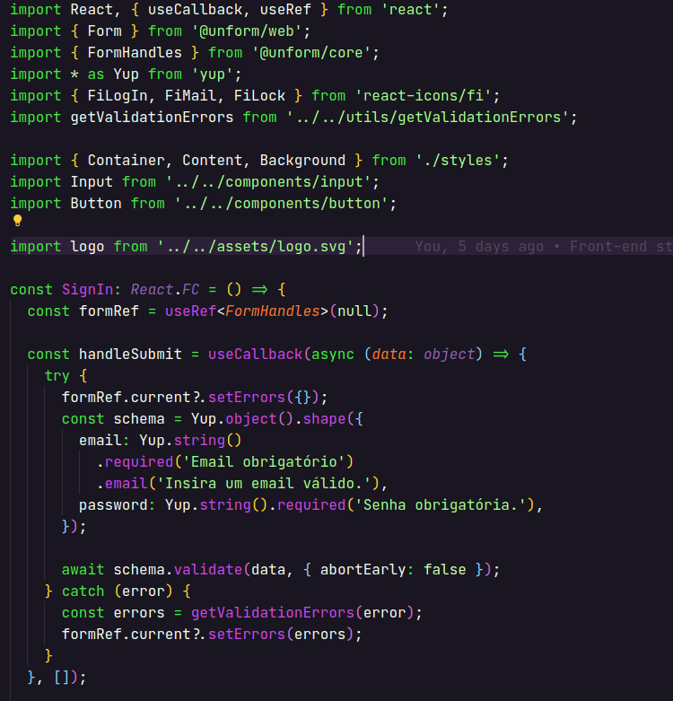

# Acid Purple

Acid Purple theme for Visual Studio Code.

Theme inspired and based on [Omni](https://github.com/getomni/vscode-omni).

#### How to install

Just clone the repository on the <b>vscode extensions folder</b>:

  Windows: 

      $ cd %USERPROFILE%\.vscode\extensions
      $ git clone https://github.com/jvitorfrancisco/acid-purple.git

  macOS:

      $ cd ~/.vscode/extensions
      $ git clone https://github.com/jvitorfrancisco/acid-purple.git

  Linux:

      $ cd ~/.vscode/extensions
      $ git clone https://github.com/jvitorfrancisco/acid-purple.git

#### Activating theme

Run Visual Studio Code. The theme will be available to select in color themes.
